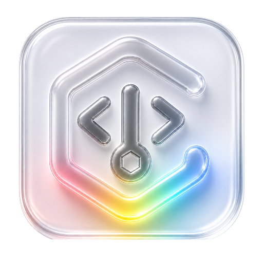
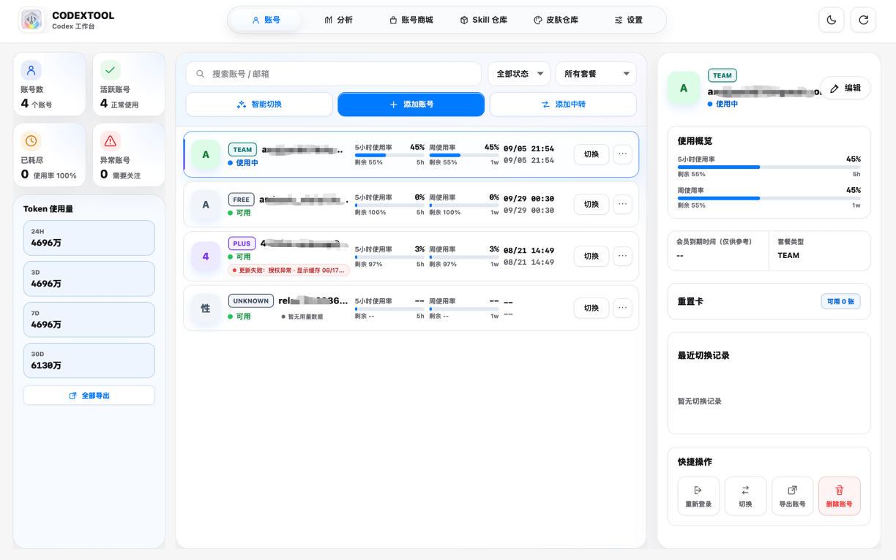
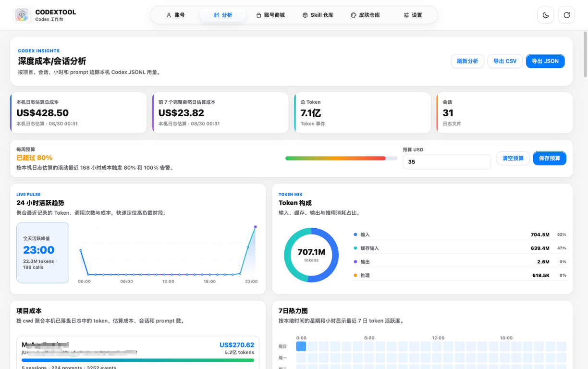
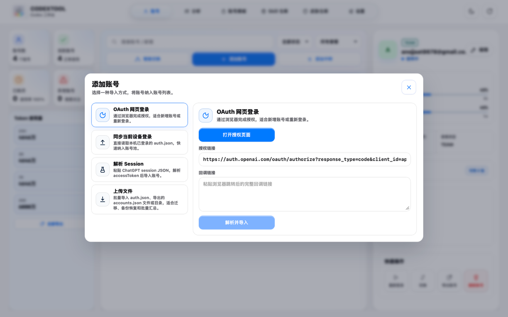
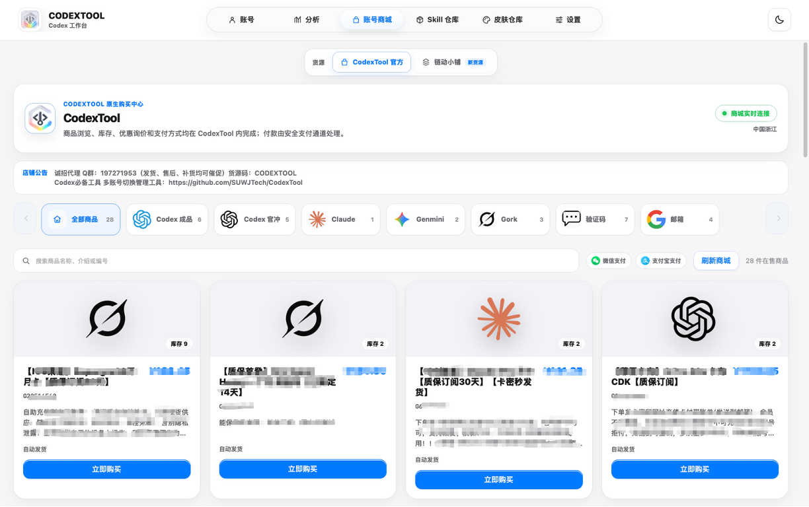
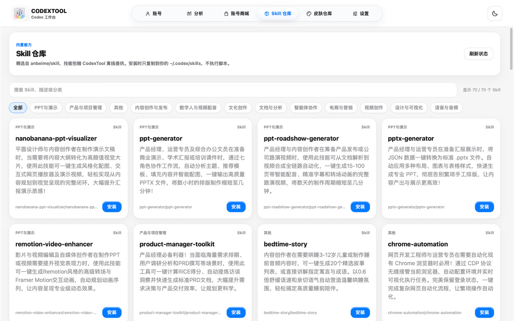
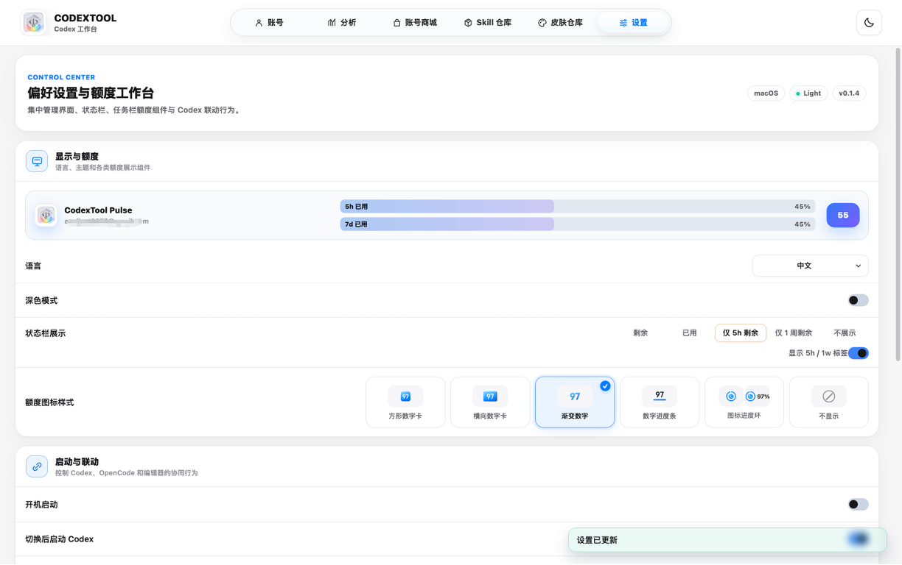
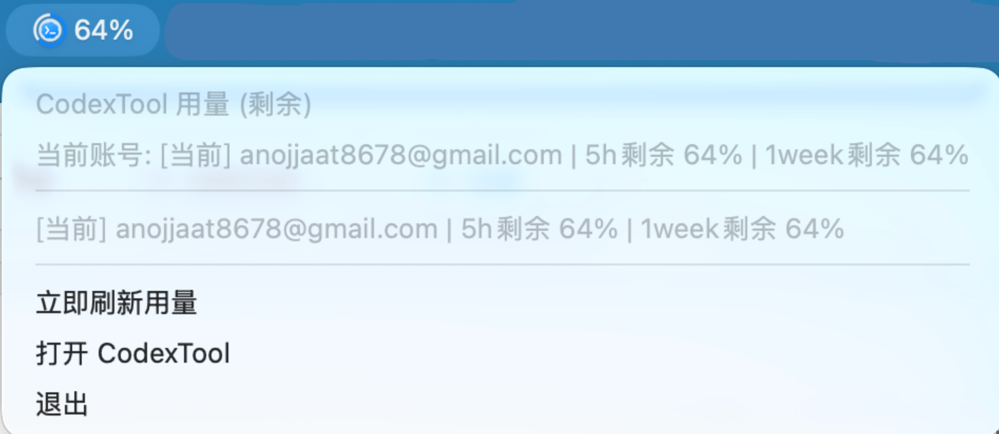

<div align="center">
  
  <h1>CodexTool</h1>
  <p><strong>一个原生、克制、面向日常使用的 Codex 桌面工作台</strong></p>
  <p>账号管理 · 用量与成本分析 · 账号商城 · Skill 仓库 · 皮肤仓库</p>

  [](https://github.com/SUWJTech/CodexTool/releases)
  [](https://github.com/SUWJTech/CodexTool/releases)
  [](https://github.com/SUWJTech/CodexTool/stargazers)
  [](LICENSE)
  [](https://v2.tauri.app/)
  [](https://react.dev/)
</div>

## 预览

<table>
  <tr>
    <td width="50%"></td>
    <td width="50%"></td>
  </tr>
  <tr>
    <td align="center"><strong>多账号管理与切换</strong></td>
    <td align="center"><strong>额度成本与会话分析</strong></td>
  </tr>
  <tr>
    <td width="50%"></td>
    <td width="50%"></td>
  </tr>
  <tr>
    <td align="center"><strong>OAuth 与文件导入</strong></td>
    <td align="center"><strong>账号商城</strong></td>
  </tr>
</table>

<table>
  <tr>
    <td width="50%"></td>
    <td width="50%"></td>
  </tr>
  <tr>
    <td align="center"><strong>Skill 仓库</strong></td>
    <td align="center"><strong>皮肤仓库</strong></td>
  </tr>
  <tr>
    <td width="50%"></td>
    <td width="50%"></td>
  </tr>
  <tr>
    <td align="center"><strong>偏好设置与额度工作台</strong></td>
    <td align="center"><strong>状态栏额度展示</strong></td>
  </tr>
</table>

## 核心能力

| 模块 | 能力 |
| --- | --- |
| 账号 | OAuth、当前设备同步、Session 解析、文件批量导入、API 中转账号、切换、别名、导出与健康状态 |
| 分析 | 本地 Codex JSONL 会话、Token、成本估算、预算、热力图与趋势可视化 |
| 账号商城 | 原生商品分类、商品详情、询价、下单、支付状态；支持多货源目录且相互隔离 |
| Skill 仓库 | 浏览 skills.sh 榜单、关键词与 SkillsMP 功能搜索；支持详情预览、Git 安装及本地 Skill 启用/禁用管理 |
| 皮肤仓库 | 读取 DreamSkin 官方主题目录，在 CodexTool 内完成下载、校验、应用、切换与恢复 |
| 系统集成 | 托盘额度、Windows 任务栏额度组件、开机启动、切换后启动、OpenCode 与编辑器联动 |

## 设计与安全原则

- **本地优先**：账号与设置写入当前用户应用数据目录，不运行本地 API 反向代理、Cloudflare 隧道、SSH 部署或独立代理守护进程。
- **原生功能**：账号商城、Skill 仓库与皮肤仓库均为应用内原生界面；仓库浏览与安装不是网页 iframe。
- **按需安装**：不再随应用打包内置 Skill；市场安装只下载目标 Skill，详情直接读取仓库 `SKILL.md`。
- **保护用户修改**：Skill 目标已存在时拒绝覆盖，并拒绝通过符号链接写入意外位置。
- **受控换肤**：Dream Skin 引擎随安装包部署；主题包经过元数据、大小、SHA-256、ZIP 路径和 Safe CSS 校验后才会应用。
- **可恢复**：皮肤事务失败会尝试恢复并验证上一主题；恢复官方外观不会修改 WindowsApps、`app.asar`、签名或 ACL。

> 应用或恢复皮肤会重启官方 Codex。主题能力取决于当前 Codex Windows 运行时是否允许经过身份校验的本机 CDP 调试端点。

## 下载与运行

前往 [Releases](https://github.com/SUWJTech/CodexTool/releases) 下载：

- `CodexTool-*-aarch64.dmg`：MacOS 安装包，双击拖动安装，签名问题可看常见问题排查。
- `CodexTool-*-setup.exe`：Windows 安装包，可选择用户/全局安装模式与目标目录。
- `CodexTool-*-portable.zip`：绿色便携版，解压后双击 `CodexTool.exe`。

Windows SmartScreen 可能会提示未知发布者；当前构建未配置商业代码签名证书，请仅从本仓库 Releases 下载并核对文件哈希。

应用内“检查更新”会直接读取本仓库最新的 GitHub Release。当前版本尚未配置跨平台更新包签名，因此发现新版本后会引导到官方 Release 页面手动下载，避免在缺少签名校验时静默替换程序。

## 常见问题排查 (Troubleshooting)

#### macOS 提示“应用已损坏，无法打开”？
#### macOS 提示“Apple无法验证“CodexTool.app””？

由于 macOS 的安全机制，非 App Store 下载的应用可能会触发此提示。当前开源发布流程尚未接入 Apple Developer ID 签名和公证，因此部分系统版本会显示更严格的 Gatekeeper 提示。您可以按照以下步骤快速修复：

1. **命令行修复**（推荐）：打开终端，执行以下命令：

   ```bash
   sudo xattr -d com.apple.quarantine "/Applications/CodexTool.app"
   ```

   > **注意**：如果您修改了应用名称，请在命令中相应调整路径。

2. **或者**：在“系统设置” → “隐私与安全性”中点击“仍要打开”。

## 本地开发

环境要求：Node.js 20.19+（推荐 22）、Rust 1.77.2+ 与 Tauri 2 对应系统依赖。

```bash
npm ci
npm run dev
npm run build
npm run tauri dev
```

质量检查：

```bash
npm run lint
npm run test:quota-onboarding
npm run test:usage-errors
cargo test --manifest-path src-tauri/Cargo.toml
```

## 技术栈

- Tauri 2 + Rust
- React 19 + TypeScript 5
- Vite 7
- 原生 PowerShell Dream Skin 运行器
- Windows 原生托盘/任务栏组件与 macOS 状态栏基础能力

## 项目来源与许可

致谢 [170-carry/codex-tools](https://github.com/170-carry/codex-tools)  
致谢 [anbeime/skill](https://github.com/anbeime/skill)  
致谢 [Fei-Away/Codex-Dream-Skin](https://github.com/Fei-Away/Codex-Dream-Skin)  
致谢 [Yiyoki/liandongxiaopu-collection](https://github.com/Yiyoki/liandongxiaopu-collection)  
致谢 [OpenAI Codex](https://openai.com/zh-Hans-CN/codex/)

项目代码采用 [MIT License](LICENSE)。内置第三方资源继续保留各自许可证、NOTICE 与必要的功能性 Markdown 文件；这些文件属于可执行 Skill/引擎资源，不是项目文档冗余。

## Star 与支持

<p align="center">
  <a href="https://github.com/SUWJTech/CodexTool/stargazers">
    
  </a>
</p>

<div align="center">
  如果 CodexTool 对你有帮助，欢迎提交 Issue、贡献改进或点亮一个 Star。
</div>
